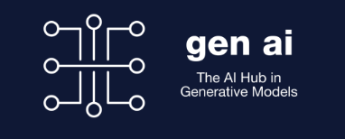

[About](#about) - [Registration](#registration) - [Schedule](#schedule) - [Keynote Speakers](#keynote-speakers)  - [Keynote Abstracts](#keynote-abstracts) - [Accepted Contributions](#accepted-contributions) - [Important Dates](#important-dates) - [Call for Papers](#call-for-papers)

## About

This will be the 5th-year edition of the ML4Molecules workshop organized by the ELLIS research program on "Machine Learning for Molecule Discovery". This research program brings together a pan-European community dedicated to accelerating molecular discovery through cutting-edge AI. The meeting will serve as a key opportunity for members and collaborators to present their latest research in the area, exchange insights, coordinate research efforts, and align on strategic goals. ML4Molecules 2025 will focus on the latest developments in generative models, large language models (LLMs), and scalable AI systems for applications in chemistry, drug discovery, and materials science. We will explore topics such as: 1) Foundation and diffusion models for molecule generation, 2) Cross-modal and cross-domain learning (e.g., text, structure, experimental data), 3) AI-driven synthesis planning and reaction prediction, 4) Interpretable and data-efficient ML approaches. 5) Practical considerations in deploying ML in real-world molecular pipelines, etc. In addition to technical sessions, this edition will host the annual meeting of the ELLIS Program on Machine Learning for Molecule Discovery. Building on the progress of previous editions — from foundational methods (2021), critical assessments (2022–2023), to the LLM and foundation model revolution (2024) — ML4Molecules 2025 will foster rigorous, interdisciplinary dialogue and chart new directions for impactful molecular AI research.

## Registration
- Physical participation:
     - Please register [here](https://discongress.eventsair.com/eurips-2025/ellis-guest/Site/Register)
- Virtual participation:
     - Please register [here](https://www.eventbrite.com/e/ellis-machine-learning-for-molecules-workshop-2025-virtual-participation-tickets-1968488753853)

## Schedule (subject to changes)
### 08:00–09:00
- **Registration**

### 09:00–10:00
- **Invited Talks**
  - 09:00–09:30 — Invited talk
  - 09:30–10:00 — Invited talk

### 10:00–10:30
- **Contributed Talks**
  - 10:00–10:15 — Contributed talk
  - 10:15–10:30 — Contributed talk

### 10:30–11:00
- **Coffee break**

### 11:00–12:30
- **Session**
  - 11:00–11:30 — Invited talk
  - 11:30–12:00 — Contributed talk
  - 12:00–12:15 — Contributed talk
  - 12:15–12:30 — Panel Discussion

### 12:30–13:30
- **Lunch**

### 13:30–15:00
- **Session**
  - 13:30–14:00 — Invited talk
  - 14:00–14:15 — Contributed talk
  - 14:15–14:30 — Contributed talk
  - 14:30–14:45 — Contributed talk
  - 14:45–15:00 — Contributed talk

### 15:00–15:30
- **Coffee break**

### 15:30–16:00
- **ELLIS Unconference — Welcome Remarks**

### 16:00–18:00
- **Parallel Sessions**
  - 16:00–16:30 — Retreat of program fellows
  - 16:00–18:00 — Poster session

### 18:00–20:00
- **Reception**

## Invited Speakers
- [Rocio Mercado](https://rociomer.github.io/)
- [Marwin Segler](https://www.microsoft.com/en-us/research/people/marwinsegler/)
- [Daniel Probst](https://www.wur.nl/en/persons/daniel-probst.htm)
- [Nadine Schneider](https://ch.linkedin.com/in/nadine-schneider-a9930511b)

## Accepted contributions

**LLMs, chemical language models & agents**  5
- #5 Task Alignment Outweighs Framework Choice in Scientific LLM Agents	*Nawaf Alampara, Martiño Ríos-García, Chandan Gupta, Sajid Mannan, Santiago Miret, N M Anoop Krishnan, Kevin Maik Jablonka*
- #8 MolecularIQ: Characterizing Chemical Reasoning Capabilities Through Symbolic Verification on Molecular Graphs	*Christoph Bartmann, Johannes Schimunek, Mykyta Ielanskyi, Philipp Seidl, Günter Klambauer, Sohvi Luukkonen* 
- #9 WEISS: Wasserstein efficient sampling strategy for LLMs in drug design	*Riccardo Tedoldi, Junyong Li, Ola Engkvist, Andrea Passerini, Annie Westerlund, Alessandro Tibo*  
- #11 Integration over Isolation: DFT descriptors boost Chemical Language Model predictive performance	*Gian-Michele Cherchi, Robert Pollice, Davi Mattoso, Hannes Hovorka*  
- #41 Exploring Temperature and Molecular Representation Effects in LLMs for Chemistry	*Laura van Weesep, Jens Sjölund, Ola Engkvist, Samuel Genheden*  

**Generative models for molecules & proteins** 5
- #1 Look the Other Way: Designing 'Positive' Molecules with Negative Data via Task Arithmetic	*Rıza Özçelik, Sarah de Ruiter, Francesca Grisoni*  
- #10 Controllable Molecular Generation with Fine-tuned Flow-matching Model	*Kunyu Wang, Jon Paul Janet, Alessandro Tibo*  
- #14 AntiDIF: Accurate and Diverse Antibody Specific Inverse Folding with Discrete Diffusion	*Nikhil Branson, Charlotte Deane*  
- #16 Auto-Encoding Molecules: Graph-Matching Capabilities Matter	*Magnus Cunow, Gerrit Großmann, Verena Wolf, Sebastian Josef Vollmer*  
- #31 FLOWR.root: A flow matching based foundation model for joint multi-purpose structure-aware 3D ligand generation and affinity prediction	*Julian Cremer, Tuan Le, Mohammad M. Ghahremanpour, Emilia Sługocka, Filipe Menezes, Djork-Arné Clevert*  

**Molecular property prediction, graphs & omics** 6
- #2 Exploring alignment of scRNA-seq models with prior knowledge	*Charlotte Claye, Pierre Marschall, Wassila Ouerdane, CELINE HUDELOT, Julien Duquesne*  
- #24 Improving Molecular Property Prediction with Score-Based Models	*Julien Horwood, José Miguel Hernández-Lobato, Dino Oglic*  
- #26 Semi-Supervised Learning for Molecular Graphs via Ensemble Consensus	*Rasmus Hannibal Tirsgaard, Marisa Wodrich, Laurits Fredsgaard, Mikkel Jordahn, Mikkel N. Schmidt*  
- #32 Robust Mechanism-of-Action Identification Through In-Context Multi-Source Domain Adaptation	*Ana Sanchez-Fernandez, Werner Zellinger, Günter Klambauer*  
- #34 Unified Bayesian Modelling of Bioactivities Across ChEMBL	*Michael Backenköhler, Joschka Groß, Andrea Volkamer*  
- #39 Formalising Hybrid Modelling Approaches for Molecular Property Prediction	*Adem R N Aouichaoui, Paul Seghers, Jens Abildskov*  

**Structure-based modelling, protein–ligand binding & MD** 7
- #3 STRIPES: a Novel Spatio-Temporal Language to Encode Dynamic Protein-Ligand Binding	*Emanuele Criscuolo, Rıza Özçelik, Francesca Grisoni*  
- #6 Unifying Structure- and Ligand-based Drug Design via Contrastive Geometric Learning	*Lisa Schneckenreiter, Sohvi Luukkonen, Lukas Friedrich, Daniel Kuhn, Günter Klambauer*  
- #23 LaM-SLidE: Latent Space Modeling of Spatial Dynamical Systems via Linked Entities	*Florian Sestak, Artur P. Toshev, Andreas Fürst, Günter Klambauer, Andreas Mayr, Johannes Brandstetter*  
- #25 Physics-Informed Surrogates in a Verified Agentic Pipeline for Robust Molecular Simulation	*David Scott Lewis, Enrique Zueco*  
- #37 FlashMD reloaded: extending the capabilities of a universal, machine-learned direct molecular dynamics propagator	*Sanggyu Chong, Filippo Bigi, Michele Ceriotti*  
- #40 MDAgent: A Modular Multi-Agent Framework for Autonomous Protein-Ligand Molecular Dynamics Simulations	*Cassandra Masschelein, Salomé Guilbert, Jeremy Goumaz, Bohdan Naida, Philippe Schwaller*  
- #42 B-Shapes: a completeness-first, rotation-invariant representation connecting spaces of ligands and pockets	*Radoslav Krivak, Christos Feidakis, Jiří Vondrášek*  

**Synthesis planning, reactions & mechanistic reasoning** 6
- #7 SynthStrategy: Programmatic Distillation of Latent Chemical Knowledge in Large Language Models	*Daniel P Armstrong, Zlatko Jončev, Andres M Bran, Philippe Schwaller*  
- #19 fragSMILES is inclined to well express chemical fragments and chirality for synthesis planning.	*Fabrizio Mastrolorito*  
- #21 Bridging Data-Driven and Expert Knowledge for Interpretable Evaluation of Synthetic Routes	*Yujia Guo, Mikhail Kabeshov, Tat Hong Duong Le, Marco Vinicio Mijangos Linares, Samuel Genheden, Giulia Bergonzini, Ola Engkvist, Samuel Kaski*  
- #22 Grounding Large Language Models in Reaction Knowledge Graphs for Synthesis Retrieval	*Olga Bunkova, Lorenzo Di Fruscia, Sophia Rupprecht, Artur M. Schweidtmann, Marcel Reinders, Jana Marie Weber*  
- #30 Teaching Language Models Mechanistic Explainability Through Arrow-Pushing	*Théo A. Neukomm, Zlatko Jončev, Philippe Schwaller*  
- #35 Synthelite: Chemist-aligned and feasibility-aware synthesis planning with LLMs	*Xuan Vu Nguyen, Daniel P Armstrong, Milena Wiegand, Andres M Bran, Zlatko Jončev, Philippe Schwaller*  

**Evaluation, interpretability, benchmarks & dataset infrastructure** 6
- #12 Evaluating 3D generative models for molecular design: an industry perspective	*Alex T. Müller, Astrid Stroobants, Jessica Lanini, Paula Torren-Peraire, Balmiki Ghosh, Finton Sirockin, Nikolas Fechner, Nadine Schneider*  
- #13 Quantifying Multi-Objective Optimization in Generative Chemistry for Molecule Design	*Paula Torren-Peraire, Nadine Schneider, Raquel Rodriguez-Perez, Robin A. Fairhurst, Jessica Lanini*  
- #20 Assay-Based Machine Learning: Rethinking Evaluation in Drug Discovery	*Michael Backenköhler, Joschka Groß, Andrea Volkamer*  
- #28 MolForge and MolBox: End-to-End Automation for Reproducible Molecular Machine Learning Datasets	*Luke Rossen, Francesca Grisoni*  
- #29 Explaining What Matters: Faithfulness in Molecular Deep Learning	*Marcel Hiltscher, Marc Bianciotto, Francesca Grisoni*  
- #36 Measuring AI Progress in Drug Discovery: A Reproducible Leaderboard for the Tox21 Challenge	*Antonia Ebner, Christoph Bartmann, Sonja Topf, Sohvi Luukkonen, Johannes Schimunek, Günter Klambauer*  

**Applications to materials, phase behaviour & large-scale screening** 3
- #4 Automated navigation of condensate phase behavior with active machine learning	*Yannick Leurs, Willem van den Hout, Andrea Gardin, Joost L.J. van Dongen, Andoni Rodriguez-Abetxuko, Nadia Erkamp, Jan van Hest, Francesca Grisoni, Luc Brunsveld*  
- #18 Extended Abstract: Surfactant Simulation and Prediction Through Machine Learning	*Richard Beckmann, Robert S. Jordan, Marisa Gliege, Santiago Miret, Vijay Kris Narasimhan, Rocío Mercado*  
- #33 Accelerated Learning on Large Scale Screens using Generative Library Models	*Eli N Weinstein, Andrei Slabodkin, Mattia G Gollub, Xiao-Bing Cui, Kerry Dobbs, Fang zhang, Kristina Gurung, Amira J Bailey, Elizabeth Baker Wood*  

## Important dates
- Submission Date for Workshop Contributions: October 15, 2025, 23:59 UTC (**extended**)
- Accept/Reject Notification Date: October 31, 2025
- **December 2, 2025**: Workshop at the [ELLIS Unconference](https://eurips.cc/ellis/) at Copenhagen

## Call for papers

We invite submissions on machine learning for molecules and materials with a special focus on generative models and large language models (LLMs) — from representation and property prediction to end‑to‑end discovery workflows and lab integration. This workshop is part of the ELLIS UnConference on December 2, 2025 (Copenhagen), co‑located with NeurIPS week.

 **Scope & Topics (include but not limited to)**
- Generative modeling for molecules/materials (diffusion, normalizing flows, autoregressive, energy‑based) with goal‑directed or multi‑objective optimization
- LLMs and agents for chemistry & materials: code‑generation for simulation/analysis, autonomous experiment planning, protocol extraction, and tool use (e.g., retrosynthesis, docking, DFT/MD pipelines)
- Multimodal and structured reasoning: text‑to‑molecule/material, text+graph+structure fusion, retrieval‑augmented generation with chemical databases and knowledge graphs
- Property prediction & simulation surrogates: equivariant GNNs, learned interatomic potentials, speeding MD/MC/DFT, uncertainty quantification & robustness
- Data‑efficient learning: active learning, few‑/self‑/weakly supervised methods, synthetic data and simulation‑augmented training
- Reaction modeling & synthesis planning, catalyst and materials discovery, inverse design across drug, agrochemical, and energy applications
- Evaluation & safety: benchmarks, reproducibility, alignment of scientific LLMs, bias/risk assessment, and responsible deployment in discovery settings
     

**Submission Instructions**
- Platform: [Openreview](https://openreview.net/group?id=ELLIS.eu/2025/Workshop/ML4Molecules)
- Format: PDF using the NeurIPS style (main text max 5 pages, excluding references and appendices).
- OR: Extended abstracts with up to 2 pages (PDF free form).
- Anonymity: Dual‑anonymous review—please anonymize your manuscript.

**Presentation & Publication Policy**
- Accepted papers will be presented as posters; a subset may be selected for spotlight talks.
- This workshop is non‑archival. Workshop papers often reflect ongoing work and will not be treated as final versions of record.

## Best Paper Award

## Sponsors
- [gen ai](https://www.genai.ac.uk/) 

## Organizing Committee and Contact
Chairs: Nadine Schneider, Francesca Grisoni, and Jose Miguel Hernandez Lobato

Organizing committee: 

Contact: [ml4molecules@ml.jku.at](ml4molecules@ml.jku.at)
